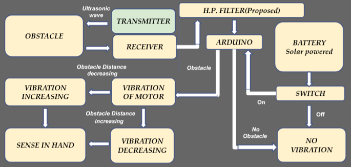
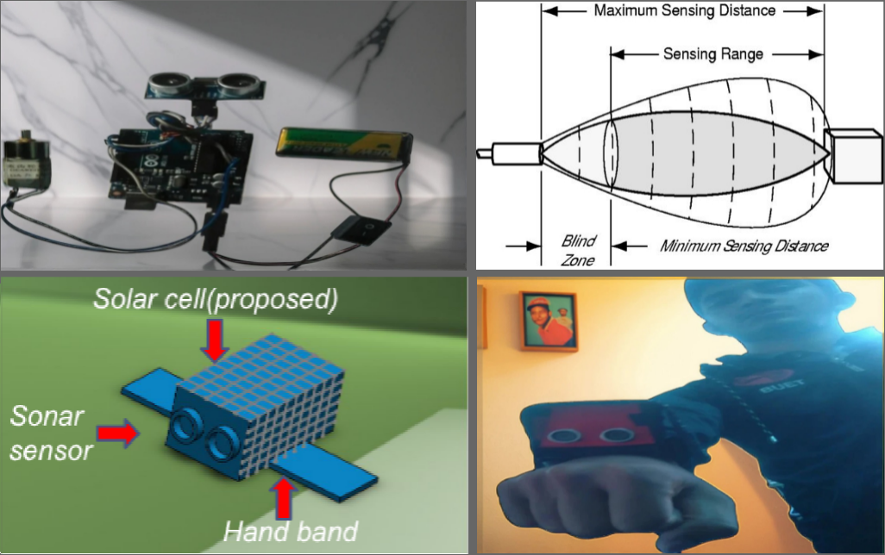

# Smart Blind Navigation Device

# Introduction
It's a low cost and light weight navigation device for blind people which is worn in hand. One needs a sonar sensor, an arduino uno, a vibrating motor, and a battery to run the device.

# Working Principle
As soon as a blind people approach any obstacle, the device will start to give signal by increasing or decreasing motor vibration and the blind person will feel the vibration in hand accordingly.

<p align="center">
  
</p>

# Execute the Code
- Clone the repo:
```
git clone https://github.com/ArghyaChatterjee/Smart-Blind-Navigation-Device.git
```
- Connect the Pins correctly with the output of the vibrating motor, the sonar sensor, and the battery.

<p align="center">
  
</p>

- Upload the code `blind_nav.io` to the Arduino and see the sensor and the motor in action.

# Pin Connections and Functionality

This Arduino sketch uses an ultrasonic sensor and a motor to respond to nearby objects. Here's how the pins are connected:

| Arduino Pin | Connected To        | Purpose                                    |
| ----------- | ------------------- | ------------------------------------------ |
| `2`         | Trig pin of HC-SR04 | Sends ultrasonic pulse                     |
| `4`         | Echo pin of HC-SR04 | Receives echo to measure distance          |
| `5`         | Motor (via driver)  | Controls motor based on proximity          |
| `A0`        | Potentiometer       | Adjusts the distance threshold dynamically |

### Functions

* Sends out an ultrasonic pulse using the **Trig** pin.
* Measures the time it takes for the echo to return using the **Echo** pin.
* Calculates the distance to an object in **cm**.
* If the object is closer than a threshold (set by the potentiometer on `A0`), it:

  * Turns the motor **ON** for `cm * 10` milliseconds.
  * Turns it **OFF** for `cm * 10` milliseconds (blinking behavior).

This setup is ideal for proximity-triggered actuation based on adjustable distance.

# Cite
- If you want to see the poster presentation at NSysS-2017, please visit: https://www.researchgate.net/publication/333370706.
  
- If you want to cite the research paper, please add these lines to the reference section of your research paper:
```
A. Chatterjee, S. Dutta, P. Sarkar and A. B. M. A. A. Islam, "Obstacle Detector for Blind
People with Low Cost (Poster Presentation)," Proceedings of 2017 International
Conference on Networking, Systems and Security (NSysS), Dhaka, 2017
```
- If you want to cite the code, add the DOI number to the reference section of your research paper: 
     [](https://zenodo.org/badge/latestdoi/224455529)

